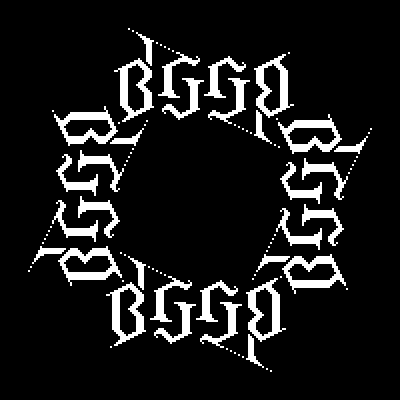
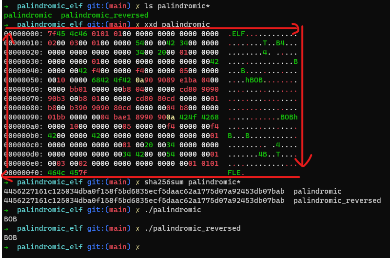

# Palindromic ELF

This is my first solution to the Binary Gold Grand Prix (BGGP), an anual event that challenges
programmers to create the smallest possible binary file that fits within certain constraints.

<p align="center">
  
</p>

## Challenge:

The challenge is to create a smallest binary file possible, that is rotational palindrome and 
executes the same forwards as it does byte-reversed.

The binary should be the same executable when flipped backwards.

### Example:

```sh
$ xxd bin | head -n 1
00000000: 7f45 4c46 0101 0100 0000 0000 0000 0000  .ELF............
```

The entire binary will be reversed, and the first byte, will be the last one.

```
00000000: 0000 0000 0000 0000 0001 0101 464c 457f .ELF............
```

## Rules:

- Any executable binary format.
- Any OS.
- Any architecture.
- Minimum should execute %50 of its bytes.
- Must execute within the mirrored section.
- Must read the same forwards as it does backwards.
- Must actually run on the target system.

## Compile and run:

Simple run make would compile and run the program beside showing some POCs.

```sh
$ make
```

You can also explore the different rules in the Makefile.

>Though the python script is used to reverse the bytes.

<p align="center">
    
</p>